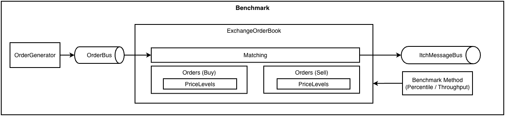

# Latency Benchmark


## Overview

TO BE WRITTEN

## Architecture



## Build requirements

- Compiler: GCC 15.2.0+
- OS: Linux, MacOS

## Build instructions

```bash
cmake -S . -B build -DCMAKE_BUILD_TYPE=Release
cmake --build build
```